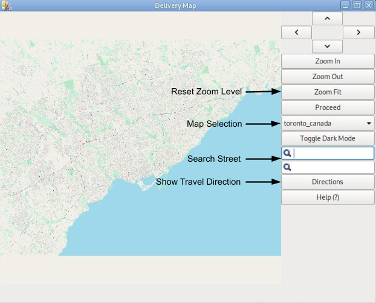
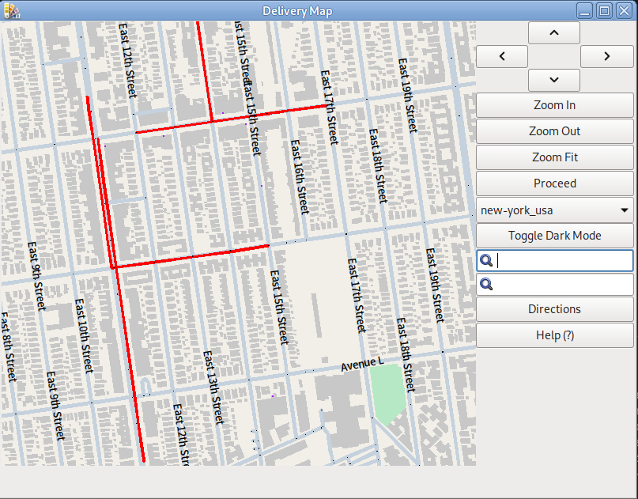
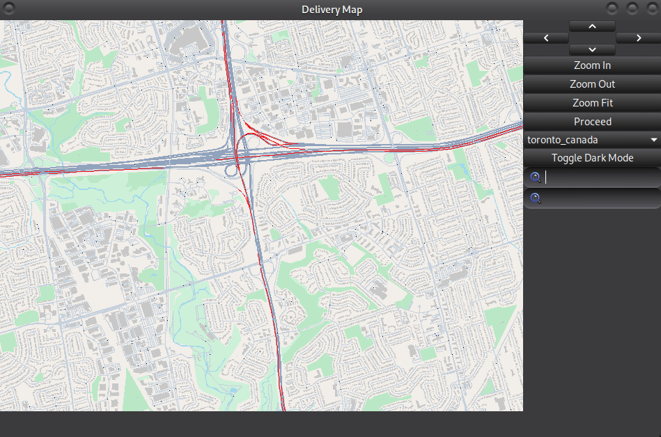
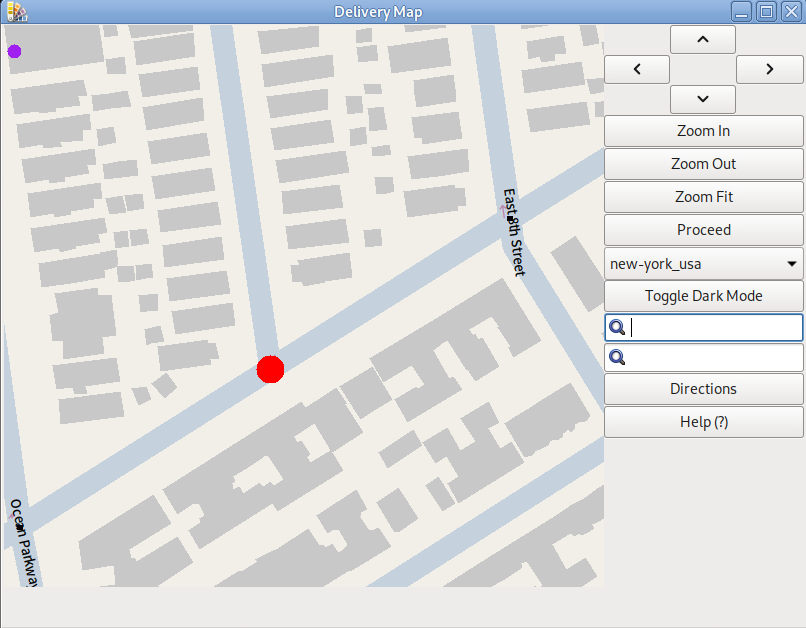
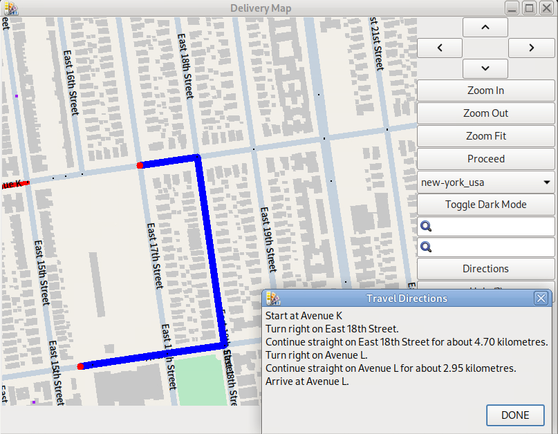
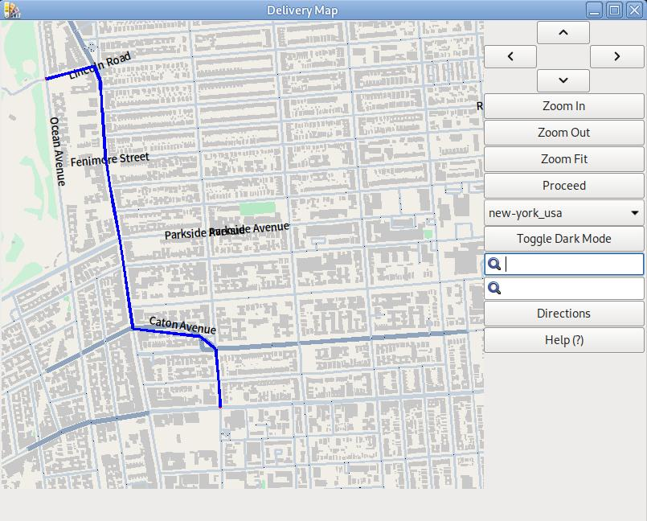

# Deliver Duo User Manual

Hi! This is **Delivery Duo**, the best helper for delivery drivers!

You can click on the outline on the left side to quickly jump to the Chapter you are looking for.

## Introduction

**Delivery Duo** is a GIS software based on GTK3 and C++, support users to import map data by themselves, the map can directly load and display map data!

## Features

### 1. Main Interface

This is the main interface of Deliver Duo.

  
**Figure 1.1: Functionalities of buttons**

### 2. Dark Mode

To toggle dark mode, click on “Toggle Dark Mode” button on the right panel to turn on, click again to turn off.

### 3. Live Traffic

Live traffic is available for many popular western cities, but is currently unavailable for many Asian cities.

Traffic jam will be shown as red solid lines on the map (Figure 4).

  
**Figure 3.1: Traffic jam shown as red solid lines**

**Notes for live traffic data:**

Our live traffic data is obtained from TomTom platform: https://www.tomtom.com. Real-time data may deviate from the actual situation, and the platform does not provide data for most Asian cities. We are not responsible for data errors.

### 4. Zoom in, Zoom out and Move

To move on Delivery Duo, simply hold mouse 1 and drag the canvas of on the left side, or click the arrow buttons on the right side.

To zoom in or zoom out, simply put the cursor on the canvas and scroll up and down, or click the ‘Zoom In’ and ‘Zoom Out’ button on the right side.

To reset zoom level, click on ‘Zoom Fit’ on the right side.

### 5. How to search an intersection?

If you wanna find an intersection by 2 street names, use the search boxes on the right of the map.

Enter the name of two streets into the search box, and press enter, the map will automatically zoom in to the intersection you searched.

The search box provide **autocomplete** feature. 

An example use is provided below:

  
**Figure 5.1: Search an intersection by 2 street names**

### 6. How to use the **Navigation** feature

To use navigation, you should set a start point and a destination on the map. 
Zoom in and click on an intersection on the map to select a start point, and click on another intersection as the destination. The selected intersection will display a red dot on it (Figure 1). 

  
**Figure 6.1: Red dot for selected point**

Once you select, a clear, fast route will be displayed (Figure 2).

  
**Figure 6.2: Navigation route**

Now, click on the “Directions” button on the right side, the travel direction text will display (Figure 3).

  
**Figure 6.3: Travel Direction Text Window**

**Notes for cancel selecting points:**

To cancel a selected point, just click the red dot again to deselect. 

To cancel a selected route, randomly select another intersection, this will automatically cancel the display of route.

Example use:

  
**Figure 6.4: Example Use of Nevigation**

## About

Delivery Duo is the **BEST** GIS Software in the universe, yes, it's the best, there's no acceptance of disagreement.
